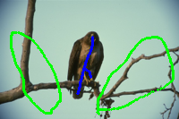
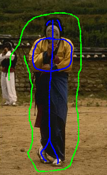
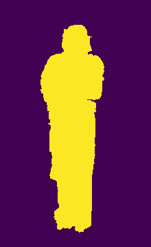
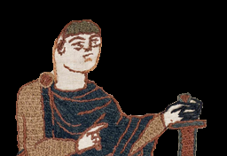
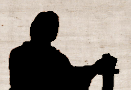

# PiSegment
A lightweight Python software for semi-supervised segmentation on images, it can be utilized for tasks such as image segmentation, background extraction, semantic segmentation, colorization, etc. The code, written in pure Python, can be easily integrated with Flask or Django backend for a web app.

# Results

| Image w annotation    | Segmentation |
| ----------- | ----------- |
|   |     |
|   |     |
|   |     |
|   |     |

| Segment 1   | Segment 2 |
| ----------- | ----------- |
|   |     |


# Video
https://github.com/aGIToz/PiSegment/assets/38216671/97f3ea98-2433-4aba-b195-e5ca67d2624a

# Installation
```
pip install pisegment
```

# Usage
- Command line
```
pisegment --input "path/to/image/tobe/segmented" --mask "path/to/the/generated/annotation"
```
- The above command opens up a GUI for image annotation. **Use right click drag for annotation. There are 9 different color options. Press `1` for black color, `2` for blue color and so on. After annotating, press `s` to let the segmentation begin**. Zoom in/out with mouse wheel and left click drag for panning image.

# Tips on using:
- By default, the denoising filter is on. If your image doesn't have noise, turn it off using the `--no_filter` option. You may also use this option if you are already using different software for denoising.
```bash
pisegment --input "path/.." --mask "path/.." --no_filter
```
- For fast processing, consider downsizing your image to under 256 X 256 to generate the segmented mask, then upscale the segmented mask to the original size.
- For complex images, like the last example in the **Results**, to get a precise segmentation, the parameter `--sig` plays a crucial role. See the **Jupyter_demo** for the workflow on how to segment such kind of images.

# How it works?
Behind the scenes, it is basically using a Dijkstra like algorithm to propagate the labels on graphs. The code is very similar to the Algorithm 2 of the following paper: https://hal.science/hal-00932510/document

# Params Description
The following description of parameters is useful for achieving good segmentation.

| Param | Description |
| --- | --- |
| sig | An important parameter for achieving good segmentation on complex images (see **Jupyter_demo**). By default, I am using a naive estimation of this parameter which may need to be fine-tuned. |
| no_filter | Turns off the denoising. |
| ps | Patch size, used for creating a non-local kNN graph for denoising. The default value is 3, which should be fine. |
| k_ | The $k$ value in the kNN graph for denoising. The default is 10. |
| k | The image grid graph $k$ value. 4 or 8 should be sufficient. The default is 4. |
```bash
pisegment --input "path/.." --mask "path/.." --sig 1.00e-02  --k 4 --k_ 10 --ps 3 --no_filter
```

